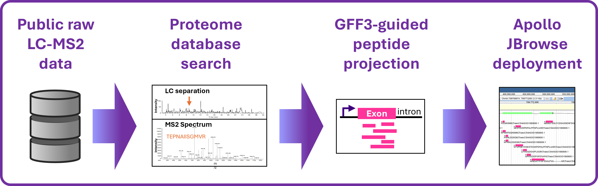

# Community Resource: A Genome-Guided Extension of Large-Scale Wheat Proteogenomics

## Author   
Dr Delphine Vincent  
_website:_ https://dlf2024.github.io/  
_github:_ https://github.com/dlf2024      
_Date:_ 18/05/2026

---

## Overview
This project aims at validating gene model annotations in bread wheat (_Triticum aestivum_, IWGSC RefSeq v2.1) using a proteogenomics strategy by identifying peptides/proteins in various wheat tissues from public proteomics experiments and aligning them along the genome.     
This study follows on our previous proteogenomics project from 2024 in which peptides identified in public repositories MSV000090572 and PXD004720 were aligned along the wheat genome using a tBLASTn strategy (_Citation:_ Vincent, D.; Appels, R. (2024) Community Resource: Large-Scale Proteogenomics to Refine Wheat Genome Annotations. Int. J. Mol. Sci. 2024, 25, 8614. https://doi.org/10.3390/ijms25168614).    
The peptide alignments along bread wheat genome are publicly available from the Apollo JBrowse service (https://bread-wheat-um.genome.edu.au/apollo/49826/jbrowse/index.html). 

---

## Workflow Summary
- Public wheat LC-MS/MS retrieval
- FragPipe/MSFragger search
- Protein-to-gene mapping
- GFF3-guided peptide projection
- BED generation
- Apollo deployment
- EDA

---

## Repository Structure
```text
Python-wheat-proteogenomics_2026/
│
├── README.md
├── LICENSE
├── CITATION.cff
│
├── notebooks/
│   └── Vincent_Proteogenomics_wheat_2026-05-18_dlf2024.ipynb
│
├── environment/
│   ├── environment.yml
│   └── software_versions.md
│
├── Python_scripts/
│
├── workflow_figures/
│   ├── graphical_abstract.png
│   └── Vincent_wheat-proteogenomics_technical-note_2026-05-18_figures.pdf
│
├── protein_database/
│   ├── iwgsc_refseqv2.1_annotation_200916_HC_LC_pep_cRAP_with_DECOY.fasta
│
├── FragPipe_results_example/
│   ├── FragPipe workflow and MSFragger search parameters.txt
│   ├── wheat_tissues_FragPipe-result-manifest.csv
│   ├── FragPipe_Duncan_PXD004720_embryo_peptide.tsv
│   ├── FragPipe_Duncan_PXD004720_embryo_protein.tsv
│
├── BED_files/
│   ├── BED6/
│   └── BED12/
│
├── Python_outputs/
│   ├── figures/
│   └── tables/
│
└── example_data/
```

---

## Data Sources

### Wheat Genome Annotation Source  
- _Citation:_ The International Wheat Genome Sequencing Consortium (IWGSC); Appels, R. et al. (2018) Shifting the Limits in Wheat Research and Breeding Using a Fully Annotated Reference Genome. Science, 361, eaar7191. https://doi.org/10.1126/science.aar7191  
- _IWGSC URL:_ https://urgi.versailles.inrae.fr/download/iwgsc/IWGSC_RefSeq_Annotations/v2.1/
- _Data files:_
  - iwgsc_refseqv2.1_annotation_200916_LC.gff3 (genome annotations of low confidence (LC) gene models)
  - iwgsc_refseqv2.1_annotation_200916_HC.gff3 (genome annotation of high confidence (HC) gene models)
  - iwgsc_refseqv2.1_functional_annotation.csv (gene model functional annotations)
  - iwgsc_refseqv2.1_annotation_200916_HC_pep.fasta (AA sequences of HC gene models)
  - iwgsc_refseqv2.1_annotation_200916_LC_pep.fasta (AA sequences of LC gene models)

### MS-Proteomics Raw Data Sources 

#### Liu et al 2025 (PXD050500)  
- _Citation:_ Liu S, et al (2025) A telomere-to-telomere genome assembly coupled with multi-omic data provides insights into the evolution of hexaploidy bread wheat. Nature Genetics, 57: 1008-1020. https://doi.org/10.1038/s41588-025-02137-x   
- _ProteomeXchange URL:_ https://proteomecentral.proteomexchange.org/cgi/GetDataset?ID=PXD050500   
- _PRIDE URL:_ https://www.ebi.ac.uk/pride/archive/projects/PXD050500    
- _FTP URL:_ https://ftp.pride.ebi.ac.uk/pride/data/archive/2024/12/PXD050500/   

#### Vincent et al 2023 (MSV000090572)    
- _Citation:_ Vincent, D. et al. (2023) A Community Resource to Mass Explore the Wheat Grain Proteome and Its Application to the Late-Maturity Alpha-Amylase (LMA) Problem. GigaScience, 12, giad084. https://doi.org/10.1093/gigascience/giad084     
- _MassIVE URL:_ https://massive.ucsd.edu/ProteoSAFe/result.jsp?task=9e8c4c3c9d924de8800237e7e828e1d9&view=advanced_view#%7B%7D   
- _FTP URL:_ ftp://massive-ftp.ucsd.edu/v05/MSV000090572/

#### Duncan et al 2017 (PXD004720)     
- _Citation:_ Duncan, O. et al (2017) Resource: Mapping the Triticum aestivum Proteome. Plant J., 89, 601-616. https://doi.org/10.1111/tpj.13402      
- _ProteomeXchange URL:_ https://proteomecentral.proteomexchange.org/ui?pxid=PXD004720    
- _PRIDE URL:_ https://www.ebi.ac.uk/pride/archive/projects/PXD004720   
- _FTP URL:_ https://ftp.pride.ebi.ac.uk/pride/data/archive/2016/11/PXD004720/

---

## Jupyter Notebook Workflow

## Quick Start

### Clone repository

```bash
git clone https://github.com/dlf2024/Python-wheat-proteogenomics_2026.git
cd wheat-proteogenomics
conda env create -f environment/environment.yml
conda activate wheat_proteogenomics
```

### Steps:  
- 1: Data retrieval and extraction (LFTP via Ubuntu Unix outside of this notebook)
- 2: Data conversion (using MSConvert GUI outside of this notebook)
- 3: Protein database creation with decoy (using Galaxy Proteomics platform outside of this notebook)
- 4: Peptide/Protein search (using FragPipe program outside of this notebook)
- 5: Build a protein-to-gene mapping table (this notebook)
- 6: FragPipe Output Annotation and Quality Summary (this notebook)
- 7: Build non-contaminant peptide–protein evidence tables (this notebook)
- 8: Map proteins to gene models using the GFF3-derived mapping table (this notebook)
- 9: Project peptide positions from proteins onto genomic coordinates (this notebook)
- 10: Positional validation of annotation-guided peptide genome projections (this notebook)
- 11: Export all tissues BED6/BED12 files for JBrowse (this notebook)
- 12: Create a single non-redundant combined BED track (this notebook)
- 13: Generate tissue/protein/gene/isoform summary tables (this notebook)
- 14: Prepare BED Files for Apollo/JBrowse Public Upload (this notebook)
- 15: EDA: HC and LC Proteogenomic Coverage by Tissue (this notebook)
- 16: EDA: Tissue Overlap Using UpSet Plots (this notebook)
- 17: EDA: Peptide Support per Gene Model (this notebook)
- 18: EDA: Peptide Length, Probability, and Charge by Annotation Confidence  (this notebook)
- 19: EDA: Protein Length versus Peptide Support (this notebook)
- 20: EDA: Chromosomal Distribution of Peptide Genomic Start Positions (this notebook)
- 21: EDA: Circular Tissue-Level Peptide Genome Map (this notebook)
- 22: EDA: Circular Confidence-Level Peptide Genome Map (this notebook)
- 23: Combine Python workflow Summary Tables at Source/Tissue Level (this notebook)
- 25: Sanity Checks for Annotation-Guided Peptide Genome Projections (this notebook)
- 26: Generate Sanity-Validated BED Files for Apollo/JBrowse Upload (this notebook)
- 27: Create Non-Redundant Combined Validated BED Tracks (this notebook)
- 28: Prepare manuscript Table 1 summary statistics (this notebook)

---

## Software Requirements

The following programs were used in this work (in no particular order):   
- Windows 10
- WSL2 Ubuntu 24.04
- Python 3.12
- JupyterLab 4.3.4
- FragPipe 24.0
- MSFragger 4.4.1
- ProteoWizard MSConvert 3.0
- Galaxy Proteomics platform

---


## Reproducibility

This repository provides a complete end-to-end reproducible workflow for large-scale wheat proteogenomics analyses using public LC-MS/MS datasets.

Included resources:
- fully annotated Jupyter notebook workflow
- standalone Python scripts
- software environment specifications
- representative FragPipe outputs
- BED6/BED12 examples
- workflow figures and manuscript visualisations
- public data source references

All analyses were performed using publicly accessible wheat proteomics datasets and IWGSC RefSeq v2.1 genome annotations.

---
## Citation

If you use this repository, please cite:

Vincent D., Appels R.  
*Community Resource: A Genome-Guided Extension of Large-Scale Wheat Proteogenomics*  
(under review)


